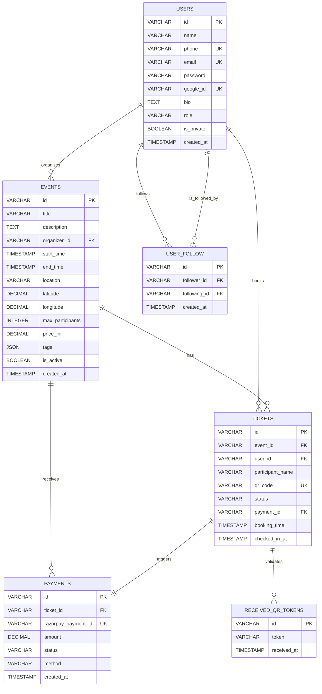

# Database Schema Documentation

## 📋 Table of Contents

1. [Overview](#overview)
2. [Users Table](#users-table)
3. [Events Table](#events-table)
4. [Tickets Table](#tickets-table)
5. [Received QR Tokens Table](#received-qr-tokens-table)
6. [User Follow Table](#user-follow-table)
7. [Payments Table](#payments-table)
8. [Relationships](#relationships)
9. [Indexes](#indexes)
10. [Migration Scripts](#migration-scripts)

## 📊 Overview

The Fitness Event Booking Platform uses a relational database design with the following core entities:

- **Users**: Authentication and user profiles
- **Events**: Fitness events and activities
- **Tickets**: Event bookings and participant management
- **Payments**: Financial transactions
- **Social Features**: User connections and privacy

### Database Configuration

- **Production**: PostgreSQL with connection pooling
- **Development**: SQLite for easy local development
- **Migrations**: Alembic for schema versioning

## 👥 Users Table

**Table Name**: `users`

| Column | Type | Constraints | Description |
|--------|------|-------------|-------------|
| `id` | VARCHAR(20) | PRIMARY KEY | Unique user identifier (format: `u_*`) |
| `name` | VARCHAR(100) | NOT NULL | User's full name |
| `phone` | VARCHAR(15) | UNIQUE, NOT NULL | Phone number with country code |
| `email` | VARCHAR(255) | UNIQUE | Email address |
| `password` | VARCHAR(255) | | Hashed password (NULL for OAuth users) |
| `google_id` | VARCHAR(100) | UNIQUE | Google OAuth user ID |
| `picture` | TEXT | | Profile image URL |
| `bio` | TEXT | | User biography |
| `strava_link` | TEXT | | Strava profile URL |
| `instagram_id` | VARCHAR(100) | | Instagram handle |
| `role` | VARCHAR(20) | DEFAULT 'user' | User role (user, admin, organizer) |
| `is_private` | BOOLEAN | DEFAULT FALSE | Privacy setting |
| `created_at` | TIMESTAMP | NOT NULL | Account creation timestamp |

### Users Table Example Data

```sql
INSERT INTO users (id, name, phone, email, role, created_at) VALUES
('u_abc123def4', 'John Doe', '+919876543210', 'john@example.com', 'user', '2025-01-04 16:08:51+05:30'),
('u_xyz789ghi0', 'Jane Smith', '+919876543211', 'jane@example.com', 'organizer', '2025-01-03 14:22:15+05:30');
```

## 🎫 Events Table

**Table Name**: `events`

| Column | Type | Constraints | Description |
|--------|------|-------------|-------------|
| `id` | VARCHAR(20) | PRIMARY KEY | Unique event identifier (format: `e_*`) |
| `title` | VARCHAR(200) | NOT NULL | Event title |
| `description` | TEXT | NOT NULL | Event description |
| `event_type` | VARCHAR(50) | | Type of fitness activity |
| `organizer_id` | VARCHAR(20) | FOREIGN KEY | Reference to users table |
| `start_time` | TIMESTAMP | NOT NULL | Event start time (IST) |
| `end_time` | TIMESTAMP | NOT NULL | Event end time (IST) |
| `location` | VARCHAR(255) | NOT NULL | Event venue/location |
| `latitude` | DECIMAL(10,8) | | Geographic latitude |
| `longitude` | DECIMAL(11,8) | | Geographic longitude |
| `max_participants` | INTEGER | | Maximum allowed participants |
| `current_participants` | INTEGER | DEFAULT 0 | Current number of participants |
| `price_inr` | DECIMAL(10,2) | DEFAULT 0 | Event price in INR |
| `difficulty_level` | VARCHAR(20) | | Difficulty level (beginner, intermediate, advanced) |
| `requirements` | TEXT | | Special requirements or equipment needed |
| `tags` | JSON | | Array of event tags |
| `images` | JSON | | Array of event image URLs |
| `registration_deadline` | TIMESTAMP | | Last date for registration |
| `is_active` | BOOLEAN | DEFAULT TRUE | Event status |
| `created_at` | TIMESTAMP | NOT NULL | Event creation timestamp |

### Events Table Example Data

```sql
INSERT INTO events (id, title, description, organizer_id, start_time, location, price_inr) VALUES
('e_xyz789ghi0', 'Morning Yoga Session', 'Relaxing yoga session for all levels', 'u_abc123def4', '2025-01-15 06:00:00+05:30', 'Central Park, Mumbai', 500.00),
('e_def456ghi7', 'Marathon Training', 'Long distance running preparation', 'u_xyz789ghi0', '2025-01-20 05:30:00+05:30', 'Marine Drive, Mumbai', 0.00);
```

## 🎫 Tickets Table

**Table Name**: `tickets`

| Column | Type | Constraints | Description |
|--------|------|-------------|-------------|
| `id` | VARCHAR(20) | PRIMARY KEY | Unique ticket identifier (format: `t_*`) |
| `event_id` | VARCHAR(20) | FOREIGN KEY | Reference to events table |
| `user_id` | VARCHAR(20) | FOREIGN KEY | Reference to users table |
| `participant_name` | VARCHAR(100) | NOT NULL | Name of the participant |
| `participant_phone` | VARCHAR(15) | | Participant's phone number |
| `participant_email` | VARCHAR(255) | | Participant's email |
| `emergency_contact` | VARCHAR(15) | | Emergency contact number |
| `qr_code` | VARCHAR(50) | UNIQUE | QR code for event check-in |
| `status` | VARCHAR(20) | DEFAULT 'confirmed' | Ticket status (confirmed, cancelled, used) |
| `payment_id` | VARCHAR(50) | | Reference to payment transaction |
| `booking_time` | TIMESTAMP | NOT NULL | When ticket was booked |
| `checked_in_at` | TIMESTAMP | | When participant checked in |

### Tickets Table Example Data

```sql
INSERT INTO tickets (id, event_id, user_id, participant_name, qr_code, status, booking_time) VALUES
('t_ticket123', 'e_xyz789ghi0', 'u_user456', 'Jane Smith', 'qr_abc123def456', 'confirmed', '2025-01-04 16:08:51+05:30'),
('t_ticket456', 'e_def456ghi7', 'u_user789', 'Mike Johnson', 'qr_xyz789ghi012', 'confirmed', '2025-01-05 10:15:22+05:30');
```

## 📱 Received QR Tokens Table

**Table Name**: `received_qr_tokens`

| Column | Type | Constraints | Description |
|--------|------|-------------|-------------|
| `id` | VARCHAR(20) | PRIMARY KEY | Unique token identifier |
| `token` | VARCHAR(100) | NOT NULL | QR token string |
| `received_at` | TIMESTAMP | NOT NULL | When token was received |

### Received QR Tokens Example Data

```sql
INSERT INTO received_qr_tokens (id, token, received_at) VALUES
('rqr_abc123', 'qr_abc123def456', '2025-01-15 06:15:00+05:30'),
('rqr_xyz456', 'qr_xyz789ghi012', '2025-01-20 05:45:00+05:30');
```

## 👥 User Follow Table

**Table Name**: `user_follow`

| Column | Type | Constraints | Description |
|--------|------|-------------|-------------|
| `id` | VARCHAR(20) | PRIMARY KEY | Unique follow relationship ID |
| `follower_id` | VARCHAR(20) | FOREIGN KEY | User who is following |
| `following_id` | VARCHAR(20) | FOREIGN KEY | User being followed |
| `created_at` | TIMESTAMP | NOT NULL | When follow relationship was created |

### User Follow Example Data

```sql
INSERT INTO user_follow (id, follower_id, following_id, created_at) VALUES
('uf_abc123', 'u_user456', 'u_abc123def4', '2025-01-01 10:00:00+05:30'),
('uf_xyz456', 'u_user789', 'u_xyz789ghi0', '2025-01-02 14:30:00+05:30');
```

## 💳 Payments Table

**Table Name**: `payments`

| Column | Type | Constraints | Description |
|--------|------|-------------|-------------|
| `id` | VARCHAR(20) | PRIMARY KEY | Unique payment identifier |
| `ticket_id` | VARCHAR(20) | FOREIGN KEY | Associated ticket |
| `razorpay_payment_id` | VARCHAR(100) | UNIQUE | Razorpay payment ID |
| `razorpay_order_id` | VARCHAR(100) | | Razorpay order ID |
| `amount` | DECIMAL(10,2) | NOT NULL | Payment amount in INR |
| `currency` | VARCHAR(3) | DEFAULT 'INR' | Payment currency |
| `status` | VARCHAR(20) | NOT NULL | Payment status |
| `method` | VARCHAR(50) | | Payment method used |
| `description` | TEXT | | Payment description |
| `created_at` | TIMESTAMP | NOT NULL | Payment creation time |
| `captured_at` | TIMESTAMP | | When payment was captured |

### Payments Example Data

```sql
INSERT INTO payments (id, ticket_id, razorpay_payment_id, amount, status, method, created_at) VALUES
('pay_abc123', 't_ticket123', 'pay_RazorpayABC123', 500.00, 'paid', 'card', '2025-01-04 16:08:51+05:30'),
('pay_xyz456', 't_ticket456', 'pay_RazorpayXYZ456', 0.00, 'free', 'none', '2025-01-05 10:15:22+05:30');
```

## 🔗 Relationships

### Entity Relationship Diagram



## 📈 Indexes

### Performance Indexes

| Table | Index Name | Columns | Type | Purpose |
|-------|------------|---------|------|---------|
| `users` | `idx_users_phone` | `phone` | UNIQUE | Fast phone number lookups |
| `users` | `idx_users_email` | `email` | UNIQUE | Fast email lookups |
| `users` | `idx_users_google_id` | `google_id` | UNIQUE | OAuth user lookups |
| `events` | `idx_events_organizer` | `organizer_id` | NON-UNIQUE | Organizer's events |
| `events` | `idx_events_datetime` | `start_time`, `end_time` | NON-UNIQUE | Date range queries |
| `events` | `idx_events_location` | `location` | NON-UNIQUE | Location-based search |
| `events` | `idx_events_active` | `is_active` | NON-UNIQUE | Active events filter |
| `tickets` | `idx_tickets_event` | `event_id` | NON-UNIQUE | Event ticket queries |
| `tickets` | `idx_tickets_user` | `user_id` | NON-UNIQUE | User's tickets |
| `tickets` | `idx_tickets_qr` | `qr_code` | UNIQUE | QR code validation |
| `tickets` | `idx_tickets_status` | `status` | NON-UNIQUE | Status filtering |
| `payments` | `idx_payments_ticket` | `ticket_id` | NON-UNIQUE | Ticket payment lookup |
| `payments` | `idx_payments_razorpay` | `razorpay_payment_id` | UNIQUE | Payment gateway reference |
| `user_follow` | `idx_user_follow_follower` | `follower_id` | NON-UNIQUE | User's following list |
| `user_follow` | `idx_user_follow_following` | `following_id` | NON-UNIQUE | User's followers list |

## 🔄 Migration Scripts

### Migration Files

1. **1e38a8803a64_add_eventid_column_to_received_qr_.py**
   - Adds `event_id` column to `received_qr_tokens` table

2. **2fda4990c91c_add_source_column_to_received_qr_tokens_.py**
   - Adds `source` column to track QR token origin

3. **3_performance_indexes.py**
   - Creates performance optimization indexes

4. **4_user_connections_table.py**
   - Creates `user_follow` table for social features

5. **5_add_registration_link_to_events.py**
   - Adds `registration_link` column to events

6. **6_add_password_column_to_users.py**
   - Adds `password` column for enhanced authentication

### Running Migrations

```bash
# Initialize migration environment
alembic init alembic

# Create new migration
alembic revision --autogenerate -m "description"

# Apply migrations
alembic upgrade head

# Rollback migration
alembic downgrade -1
```

## 🔍 Data Types and Constraints

### Common Data Types

- **VARCHAR(n)**: Variable length character strings
- **TEXT**: Long form text data
- **DECIMAL(p,s)**: Fixed-point numbers (price, coordinates)
- **INTEGER**: Whole numbers (counts, quantities)
- **BOOLEAN**: True/false values
- **TIMESTAMP**: Date and time with timezone
- **JSON**: Structured data (tags, metadata)

### Constraint Types

- **PRIMARY KEY**: Unique identifier for each row
- **FOREIGN KEY**: References to other tables
- **UNIQUE**: Ensures no duplicate values
- **NOT NULL**: Required fields
- **DEFAULT**: Default values for optional fields
- **CHECK**: Custom validation rules

## 🚀 Database Performance

### Connection Pooling

```python
# Configuration in core/config.py
DB_POOL_SIZE = 100
DB_MAX_OVERFLOW = 200
DB_POOL_RECYCLE = 1800  # 30 minutes
DB_POOL_TIMEOUT = 30
```

### Query Optimization

- **Indexes** on frequently queried columns
- **Connection pooling** for high concurrency
- **Query result caching** via Redis
- **Batch operations** for bulk updates

### Monitoring Queries

```sql
-- Check table sizes
SELECT table_name, table_rows
FROM information_schema.tables
WHERE table_schema = 'public';

-- Check index usage
SELECT * FROM pg_stat_user_indexes
WHERE relname = 'your_table_name';

-- Check slow queries
SELECT * FROM pg_stat_statements
ORDER BY mean_time DESC;
```

## 🔒 Security Considerations

### Data Protection

- **Password Hashing**: bcrypt with salt rounds
- **PII Encryption**: Sensitive user data encryption at rest
- **Access Control**: Row Level Security (RLS) policies
- **Audit Logging**: All data changes logged

### GDPR Compliance

- **Data Minimization**: Only collect necessary information
- **Right to Erasure**: User data deletion capabilities
- **Consent Management**: Explicit consent for data processing
- **Data Portability**: Export user data functionality

---

## 📝 Best Practices

1. **Always use transactions** for related operations
2. **Implement proper indexing** for query performance
3. **Use connection pooling** for production workloads
4. **Regular backup** of production data
5. **Monitor query performance** and optimize slow queries
6. **Implement proper error handling** for database operations

## 🔧 Maintenance

### Regular Tasks

- **VACUUM ANALYZE**: Reclaim space and update statistics
- **Index maintenance**: REINDEX when necessary
- **Connection monitoring**: Check for idle connections
- **Performance monitoring**: Track slow queries

### Backup Strategy

- **Automated backups**: Daily database snapshots
- **Point-in-time recovery**: Continuous archiving
- **Cross-region replication**: Disaster recovery
- **Backup testing**: Regular restore verification

---

*Last Updated: January 2025*
*Schema Version: v2.0.0*
