# Flow Diagrams Documentation

## 📋 Table of Contents

1. [Authentication Flows](#authentication-flows)
2. [Event Management Flows](#event-management-flows)
3. [Ticket Booking Flows](#ticket-booking-flows)
4. [Payment Processing Flows](#payment-processing-flows)
5. [Social Features Flows](#social-features-flows)
6. [QR Code System Flows](#qr-code-system-flows)
7. [System Architecture Flows](#system-architecture-flows)
8. [Error Handling Flows](#error-handling-flows)

## 🔐 Authentication Flows

### User Registration Flow

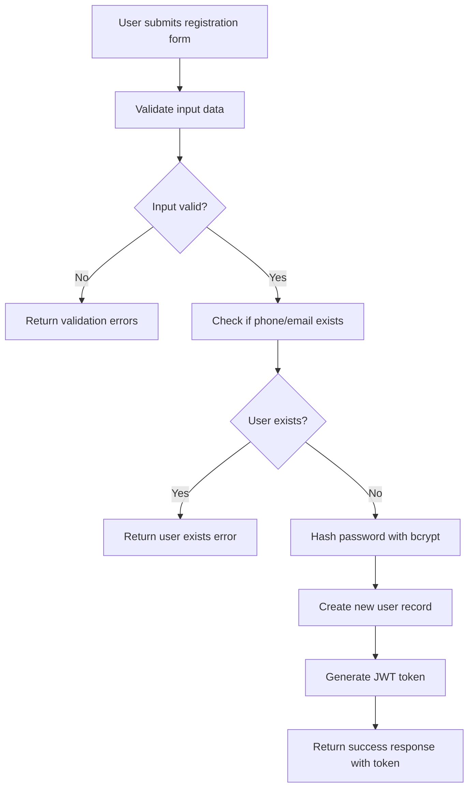
```mermaid
graph TD
    A[User submits registration form] --> B[Validate input data]
    B --> C{Input valid?}
    C -->|No| D[Return validation errors]
    C -->|Yes| E[Check if phone/email exists]
    E --> F{User exists?}
    F -->|Yes| G[Return user exists error]
    F -->|No| H[Hash password with bcrypt]
    H --> I[Create new user record]
    I --> J[Generate JWT token]
    J --> K[Return success response with token]
```

### Login Flow

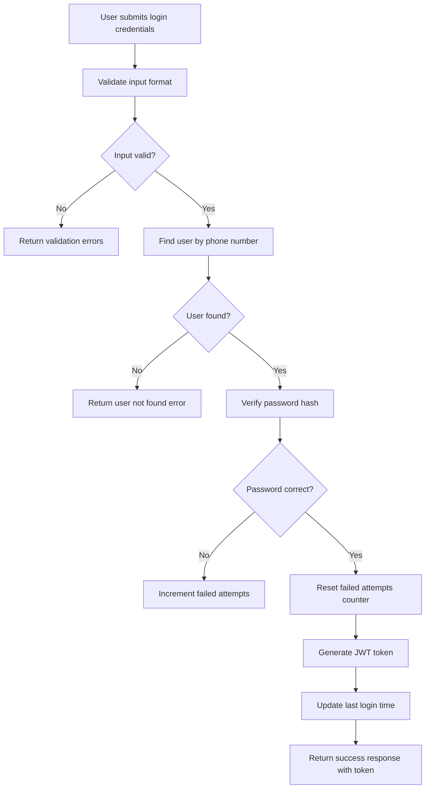
```mermaid
graph TD
    A[User submits login credentials] --> B[Validate input format]
    B --> C{Input valid?}
    C -->|No| D[Return validation errors]
    C -->|Yes| E[Find user by phone number]
    E --> F{User found?}
    F -->|No| G[Return user not found error]
    F -->|Yes| H[Verify password hash]
    H --> I{Password correct?}
    I -->|No| J[Increment failed attempts]
    I -->|Yes| K[Reset failed attempts counter]
    K --> L[Generate JWT token]
    L --> M[Update last login time]
    M --> N[Return success response with token]
```

### Google OAuth Flow

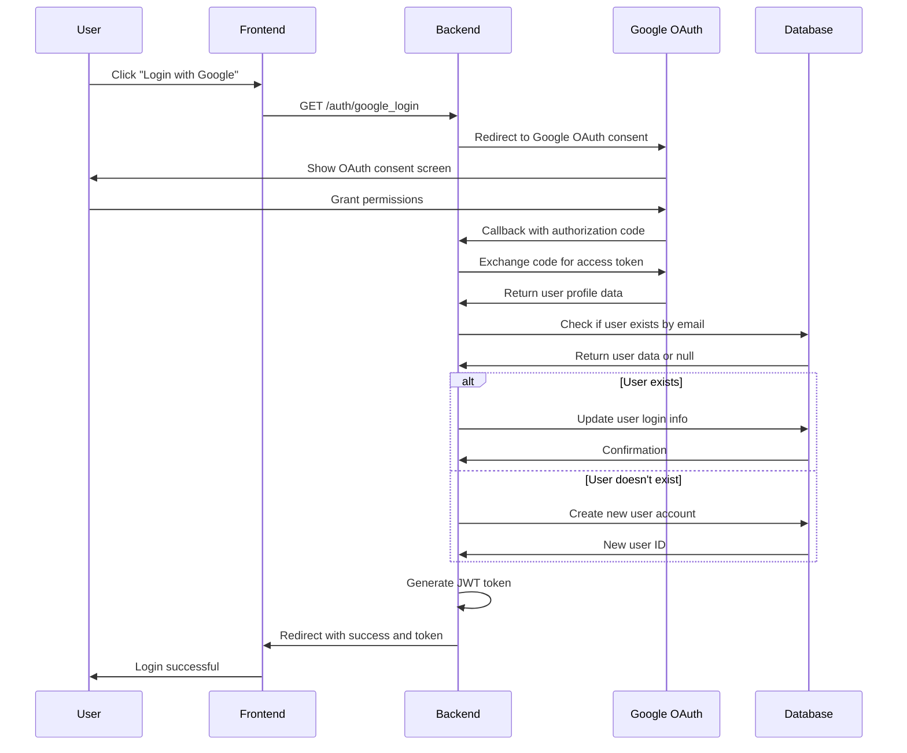
```mermaid
sequenceDiagram
    participant U as User
    participant F as Frontend
    participant B as Backend
    participant G as Google OAuth
    participant D as Database

    U->>F: Click "Login with Google"
    F->>B: GET /auth/google_login
    B->>G: Redirect to Google OAuth consent
    G->>U: Show OAuth consent screen
    U->>G: Grant permissions
    G->>B: Callback with authorization code
    B->>G: Exchange code for access token
    G->>B: Return user profile data
    B->>D: Check if user exists by email
    D->>B: Return user data or null

    alt User exists
        B->>D: Update user login info
        D->>B: Confirmation
    else User doesn't exist
        B->>D: Create new user account
        D->>B: New user ID
    end

    B->>B: Generate JWT token
    B->>F: Redirect with success and token
    F->>U: Login successful
```

### OTP Verification Flow

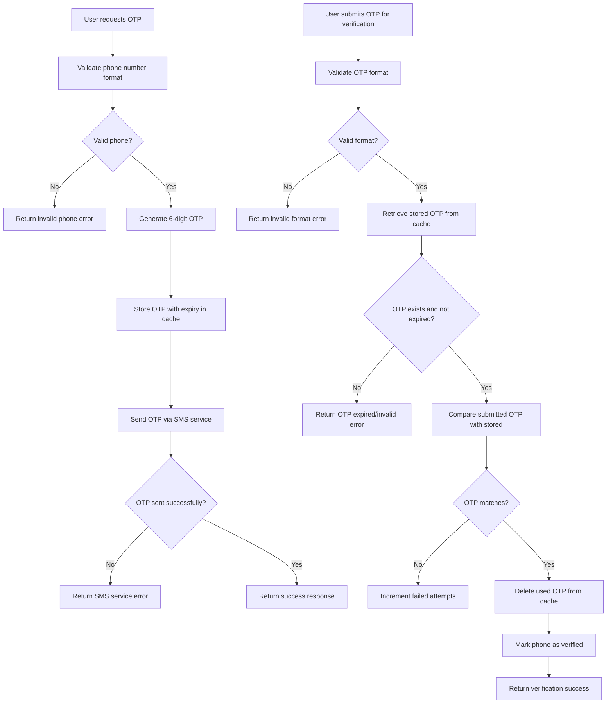
```mermaid
graph TD
    A[User requests OTP] --> B[Validate phone number format]
    B --> C{Valid phone?}
    C -->|No| D[Return invalid phone error]
    C -->|Yes| E[Generate 6-digit OTP]
    E --> F[Store OTP with expiry in cache]
    F --> G[Send OTP via SMS service]
    G --> H{OTP sent successfully?}
    H -->|No| I[Return SMS service error]
    H -->|Yes| J[Return success response]

    K[User submits OTP for verification] --> L[Validate OTP format]
    L --> M{Valid format?}
    M -->|No| N[Return invalid format error]
    M -->|Yes| O[Retrieve stored OTP from cache]
    O --> P{OTP exists and not expired?}
    P -->|No| Q[Return OTP expired/invalid error]
    P -->|Yes| R[Compare submitted OTP with stored]
    R --> S{OTP matches?}
    S -->|No| T[Increment failed attempts]
    S -->|Yes| U[Delete used OTP from cache]
    U --> V[Mark phone as verified]
    V --> W[Return verification success]
```

## 🎫 Event Management Flows

### Event Creation Flow

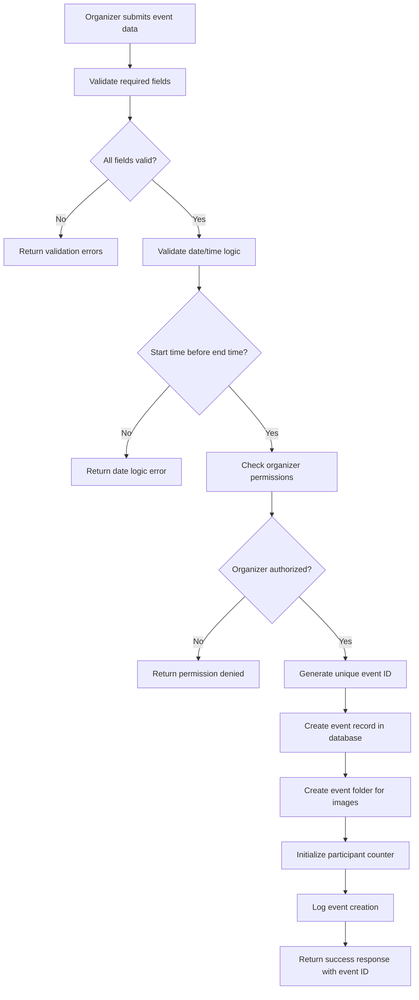
```mermaid
graph TD
    A[Organizer submits event data] --> B[Validate required fields]
    B --> C{All fields valid?}
    C -->|No| D[Return validation errors]
    C -->|Yes| E[Validate date/time logic]
    E --> F{Start time before end time?}
    F -->|No| G[Return date logic error]
    F -->|Yes| H[Check organizer permissions]
    H --> I{Organizer authorized?}
    I -->|No| J[Return permission denied]
    I -->|Yes| K[Generate unique event ID]
    K --> L[Create event record in database]
    L --> M[Create event folder for images]
    M --> N[Initialize participant counter]
    N --> O[Log event creation]
    O --> P[Return success response with event ID]
```

### Event Discovery Flow

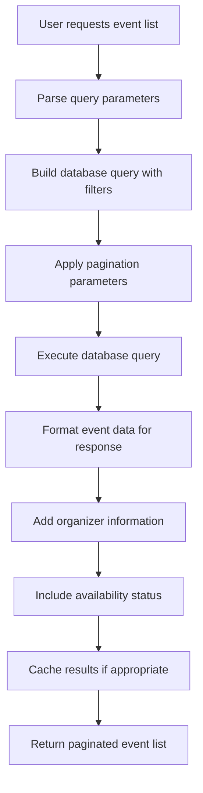
```mermaid
graph TD
    A[User requests event list] --> B[Parse query parameters]
    B --> C[Build database query with filters]
    C --> D[Apply pagination parameters]
    D --> E[Execute database query]
    E --> F[Format event data for response]
    F --> G[Add organizer information]
    G --> H[Include availability status]
    H --> I[Cache results if appropriate]
    I --> J[Return paginated event list]
```

## 🎫 Ticket Booking Flows

### Ticket Booking Flow

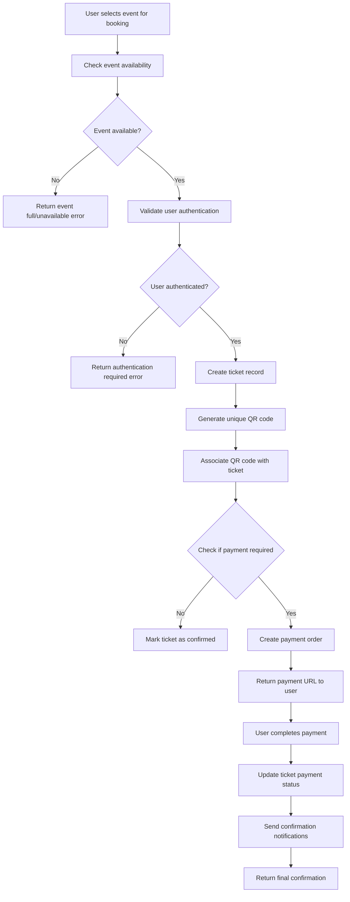
```mermaid
graph TD
    A[User selects event for booking] --> B[Check event availability]
    B --> C{Event available?}
    C -->|No| D[Return event full/unavailable error]
    C -->|Yes| E[Validate user authentication]
    E --> F{User authenticated?}
    F -->|No| G[Return authentication required error]
    F -->|Yes| H[Create ticket record]
    H --> I[Generate unique QR code]
    I --> J[Associate QR code with ticket]
    J --> K{Check if payment required}
    K -->|No| L[Mark ticket as confirmed]
    K -->|Yes| M[Create payment order]
    M --> N[Return payment URL to user]
    N --> O[User completes payment]
    O --> P[Update ticket payment status]
    P --> Q[Send confirmation notifications]
    Q --> R[Return final confirmation]
```

### QR Code Validation Flow

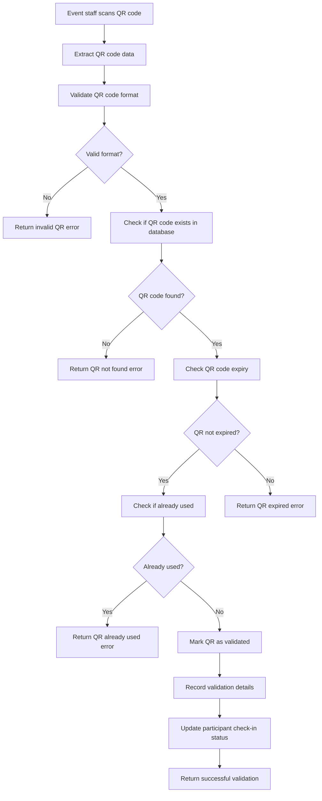
```mermaid
graph TD
    A[Event staff scans QR code] --> B[Extract QR code data]
    B --> C[Validate QR code format]
    C --> D{Valid format?}
    D -->|No| E[Return invalid QR error]
    D -->|Yes| F[Check if QR code exists in database]
    F --> G{QR code found?}
    G -->|No| H[Return QR not found error]
    G -->|Yes| I[Check QR code expiry]
    I --> J{QR not expired?}
    J -->|Yes| K[Check if already used]
    J -->|No| L[Return QR expired error]
    K --> M{Already used?}
    M -->|Yes| N[Return QR already used error]
    M -->|No| O[Mark QR as validated]
    O --> P[Record validation details]
    P --> Q[Update participant check-in status]
    Q --> R[Return successful validation]
```

## 💳 Payment Processing Flows

### Payment Flow

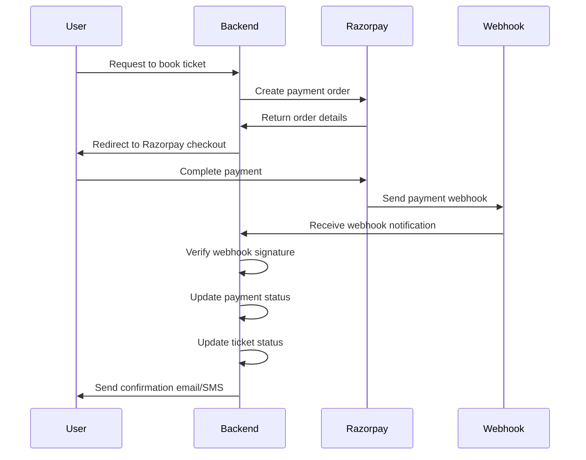
```mermaid
sequenceDiagram
    participant U as User
    participant B as Backend
    participant R as Razorpay
    participant W as Webhook

    U->>B: Request to book ticket
    B->>R: Create payment order
    R->>B: Return order details
    B->>U: Redirect to Razorpay checkout
    U->>R: Complete payment
    R->>W: Send payment webhook
    W->>B: Receive webhook notification
    B->>B: Verify webhook signature
    B->>B: Update payment status
    B->>B: Update ticket status
    B->>U: Send confirmation email/SMS
```

### Payment Webhook Verification

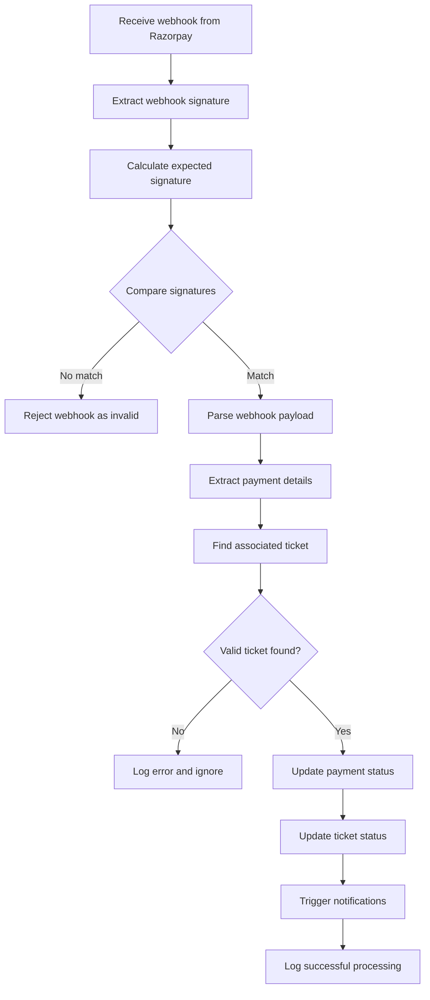
```mermaid
graph TD
    A[Receive webhook from Razorpay] --> B[Extract webhook signature]
    B --> C[Calculate expected signature]
    C --> D{Compare signatures}
    D -->|No match| E[Reject webhook as invalid]
    D -->|Match| F[Parse webhook payload]
    F --> G[Extract payment details]
    G --> H[Find associated ticket]
    H --> I{Valid ticket found?}
    I -->|No| J[Log error and ignore]
    I -->|Yes| K[Update payment status]
    K --> L[Update ticket status]
    L --> M[Trigger notifications]
    M --> N[Log successful processing]
```

## 👥 Social Features Flows

### User Following Flow

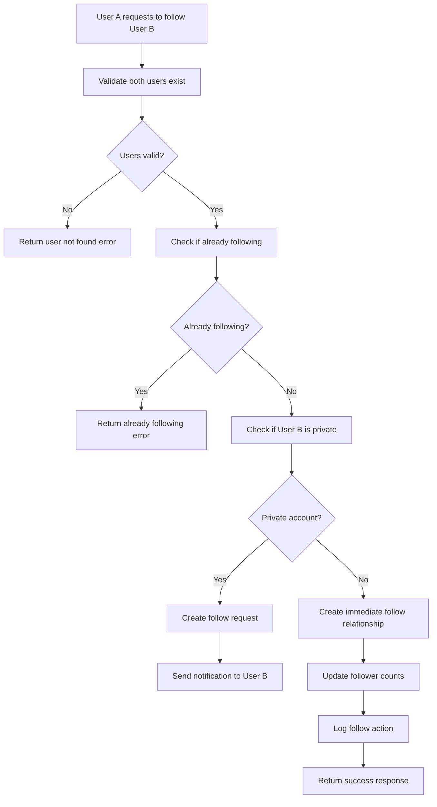
```mermaid
graph TD
    A[User A requests to follow User B] --> B[Validate both users exist]
    B --> C{Users valid?}
    C -->|No| D[Return user not found error]
    C -->|Yes| E[Check if already following]
    E --> F{Already following?}
    F -->|Yes| G[Return already following error]
    F -->|No| H[Check if User B is private]
    H --> I{Private account?}
    I -->|Yes| J[Create follow request]
    I -->|No| K[Create immediate follow relationship]
    J --> L[Send notification to User B]
    K --> M[Update follower counts]
    M --> N[Log follow action]
    N --> O[Return success response]
```

### Privacy Settings Flow

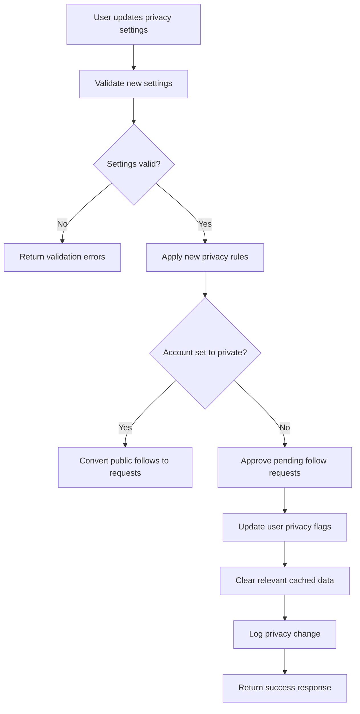
```mermaid
graph TD
    A[User updates privacy settings] --> B[Validate new settings]
    B --> C{Settings valid?}
    C -->|No| D[Return validation errors]
    C -->|Yes| E[Apply new privacy rules]
    E --> F{Account set to private?}
    F -->|Yes| G[Convert public follows to requests]
    F -->|No| H[Approve pending follow requests]
    H --> I[Update user privacy flags]
    I --> J[Clear relevant cached data]
    J --> K[Log privacy change]
    K --> L[Return success response]
```

## 📱 QR Code System Flows

### QR Code Generation

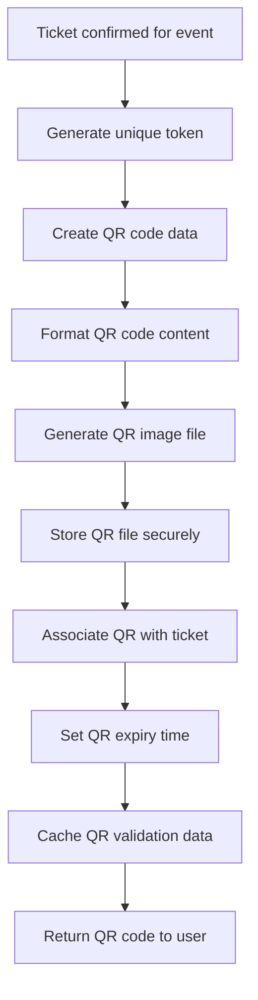
```mermaid
graph TD
    A[Ticket confirmed for event] --> B[Generate unique token]
    B --> C[Create QR code data]
    C --> D[Format QR code content]
    D --> E[Generate QR image file]
    E --> F[Store QR file securely]
    F --> G[Associate QR with ticket]
    G --> H[Set QR expiry time]
    H --> I[Cache QR validation data]
    I --> J[Return QR code to user]
```

### QR Code Validation at Event

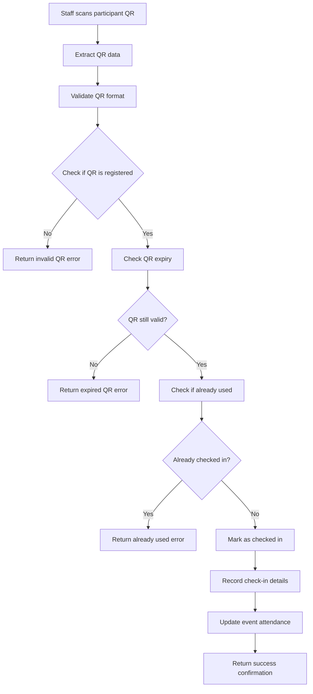
```mermaid
graph TD
    A[Staff scans participant QR] --> B[Extract QR data]
    B --> C[Validate QR format]
    C --> D{Check if QR is registered}
    D -->|No| E[Return invalid QR error]
    D -->|Yes| F[Check QR expiry]
    F --> G{QR still valid?}
    G -->|No| H[Return expired QR error]
    G -->|Yes| I[Check if already used]
    I --> J{Already checked in?}
    J -->|Yes| K[Return already used error]
    J -->|No| L[Mark as checked in]
    L --> M[Record check-in details]
    M --> N[Update event attendance]
    N --> O[Return success confirmation]
```

## 🏗️ System Architecture Flows

### Request Processing Flow

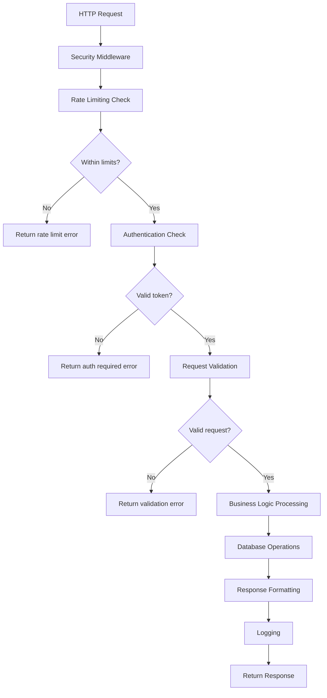
```mermaid
graph TD
    A[HTTP Request] --> B[Security Middleware]
    B --> C[Rate Limiting Check]
    C --> D{Within limits?}
    D -->|No| E[Return rate limit error]
    D -->|Yes| F[Authentication Check]
    F --> G{Valid token?}
    G -->|No| H[Return auth required error]
    G -->|Yes| I[Request Validation]
    I --> J{Valid request?}
    J -->|No| K[Return validation error]
    J -->|Yes| L[Business Logic Processing]
    L --> M[Database Operations]
    M --> N[Response Formatting]
    N --> O[Logging]
    O --> P[Return Response]
```

### Database Connection Flow

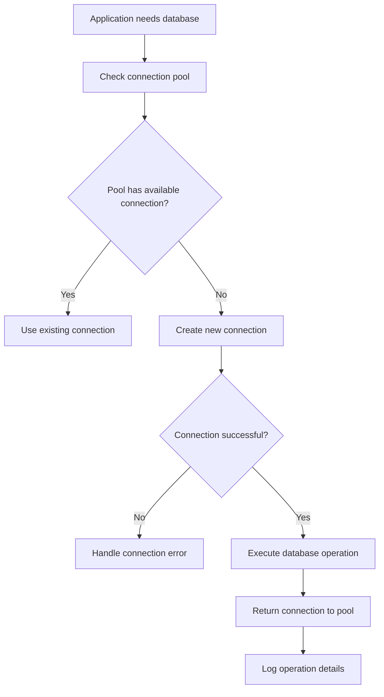
```mermaid
graph TD
    A[Application needs database] --> B[Check connection pool]
    B --> C{Pool has available connection?}
    C -->|Yes| D[Use existing connection]
    C -->|No| E[Create new connection]
    E --> F{Connection successful?}
    F -->|No| G[Handle connection error]
    F -->|Yes| H[Execute database operation]
    H --> I[Return connection to pool]
    I --> J[Log operation details]
```

## ❌ Error Handling Flows

### Global Error Handling

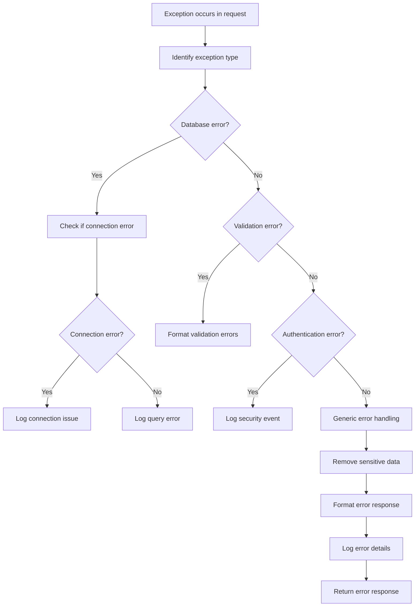
```mermaid
graph TD
    A[Exception occurs in request] --> B[Identify exception type]
    B --> C{Database error?}
    C -->|Yes| D[Check if connection error]
    D --> E{Connection error?}
    E -->|Yes| F[Log connection issue]
    E -->|No| G[Log query error]
    C -->|No| H{Validation error?}
    H -->|Yes| I[Format validation errors]
    H -->|No| J{Authentication error?}
    J -->|Yes| K[Log security event]
    J -->|No| L[Generic error handling]
    L --> M[Remove sensitive data]
    M --> N[Format error response]
    N --> O[Log error details]
    O --> P[Return error response]
```

### Payment Error Handling

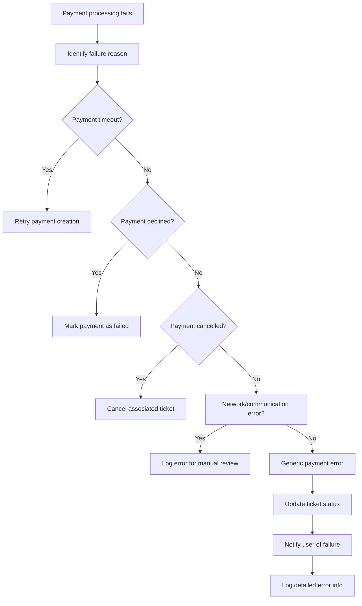
```mermaid
graph TD
    A[Payment processing fails] --> B[Identify failure reason]
    B --> C{Payment timeout?}
    C -->|Yes| D[Retry payment creation]
    C -->|No| E{Payment declined?}
    E -->|Yes| F[Mark payment as failed]
    E -->|No| G{Payment cancelled?}
    G -->|Yes| H[Cancel associated ticket]
    G -->|No| I[Network/communication error?]
    I -->|Yes| J[Log error for manual review]
    I -->|No| K[Generic payment error]
    K --> L[Update ticket status]
    L --> M[Notify user of failure]
    M --> N[Log detailed error info]
```

## 🔄 Caching Flows

### Cache Strategy Flow

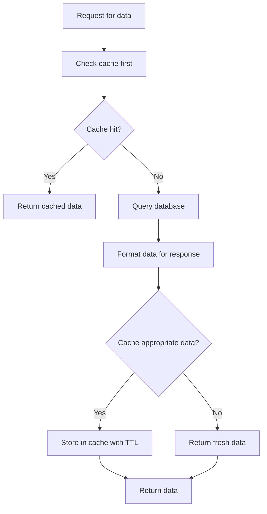
```mermaid
graph TD
    A[Request for data] --> B[Check cache first]
    B --> C{Cache hit?}
    C -->|Yes| D[Return cached data]
    C -->|No| E[Query database]
    E --> F[Format data for response]
    F --> G{Cache appropriate data?}
    G -->|Yes| H[Store in cache with TTL]
    G -->|No| I[Return fresh data]
    H --> J[Return data]
    I --> J
```

### Cache Invalidation Flow

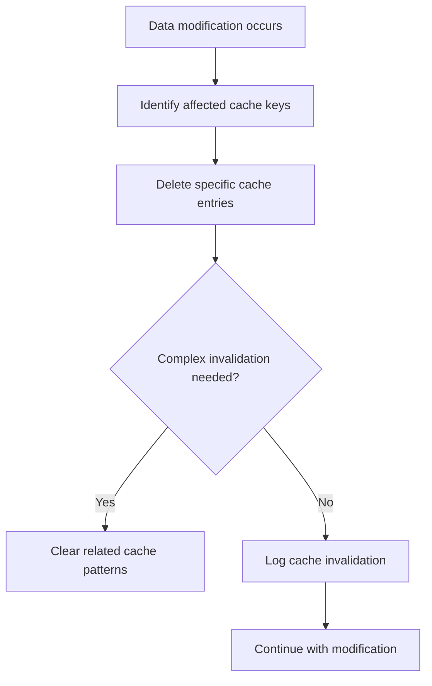
```mermaid
graph TD
    A[Data modification occurs] --> B[Identify affected cache keys]
    B --> C[Delete specific cache entries]
    C --> D{Complex invalidation needed?}
    D -->|Yes| E[Clear related cache patterns]
    D -->|No| F[Log cache invalidation]
    F --> G[Continue with modification]
```

## 📊 Monitoring Flows

### Health Check Flow

```mermaid
graph TD
    A[Health check requested] --> B[Test database connection]
    B --> C{Database OK?}
    C -->|No| D[Mark database unhealthy]
    C -->|Yes| E[Test Redis connection]
    E --> F{Redis OK?}
    F -->|No| G[Mark cache unhealthy]
    F -->|Yes| H[Check file system access]
    H --> I{File system OK?}
    I -->|No| J[Mark storage unhealthy]
    I -->|Yes| K[Check memory usage]
    K --> L{Memory OK?}
    L -->|No| M[Mark memory unhealthy]
    L -->|Yes| N[Compile health status]
    N --> O[Return health response]
```

## 🚨 Security Monitoring Flows

### Suspicious Activity Detection

```mermaid
graph TD
    A[Security event detected] --> B[Analyze event pattern]
    B --> C{Multiple failed logins?}
    C -->|Yes| D[Flag IP for monitoring]
    C -->|No| E{SQL injection attempt?}
    E -->|Yes| F[Block IP temporarily]
    E -->|No| G{Rate limit violation?}
    G -->|Yes| H[Apply stricter limits]
    G -->|No| I{Unusual access pattern?}
    I -->|Yes| J[Log for manual review]
    I -->|No| K[Continue normal processing]
    D --> L[Log security event]
    F --> L
    H --> L
    J --> L
    L --> M[Alert security team if needed]
```

## 🔧 Maintenance Flows

### Database Migration Flow

```mermaid
graph TD
    A[Deploy new migration] --> B[Backup current database]
    B --> C{Backup successful?}
    C -->|No| D[Abort migration]
    C -->|Yes| E[Lock application for maintenance]
    E --> F[Run migration script]
    F --> G{Migration successful?}
    G -->|No| H[Restore from backup]
    G -->|Yes| I[Verify data integrity]
    I --> J{Data integrity OK?}
    J -->|No| K[Restore from backup]
    J -->|Yes| L[Unlock application]
    L --> M[Log migration completion]
    M --> N[Notify team of completion]
```

## 📈 Performance Monitoring Flows

### Performance Metrics Collection

```mermaid
graph TD
    A[Request completes] --> B[Record response time]
    B --> C[Update metrics counters]
    C --> D{Check performance thresholds}
    D --> E{Performance degraded?}
    E -->|Yes| F[Trigger performance alert]
    E -->|No| G[Store metrics for analysis]
    G --> H{Analyze trends}
    H --> I{Trends indicate issues?}
    I -->|Yes| J[Recommend optimization]
    I -->|No| K[Continue normal monitoring]
    F --> L[Log performance issue]
    J --> L
    L --> M[Alert operations team]
```

---

## 📝 Diagram Key

### Symbols Used

- **Rectangles**: Process steps or actions
- **Diamonds**: Decision points or validations
- **Arrows**: Flow direction
- **Cylinders**: Database operations
- **Clouds**: External services or APIs

### Color Coding

- 🔵 **Blue**: User interactions
- 🟢 **Green**: Successful operations
- 🔴 **Red**: Error conditions
- 🟡 **Yellow**: Decision points
- 🟣 **Purple**: External services

### Flow Types

- **Sequence Diagrams**: Time-ordered interactions
- **Flowcharts**: Process logic and decisions
- **Entity Relationship**: Data structure relationships
- **Architecture Diagrams**: System component interactions

---

*Last Updated: January 2025*
*Diagrams Version: v2.0.0*
