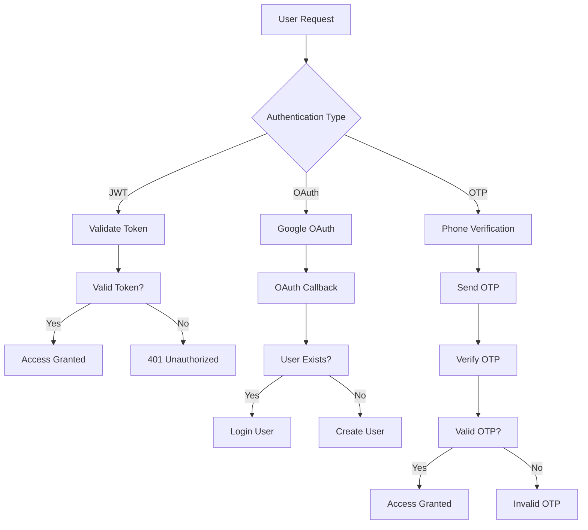
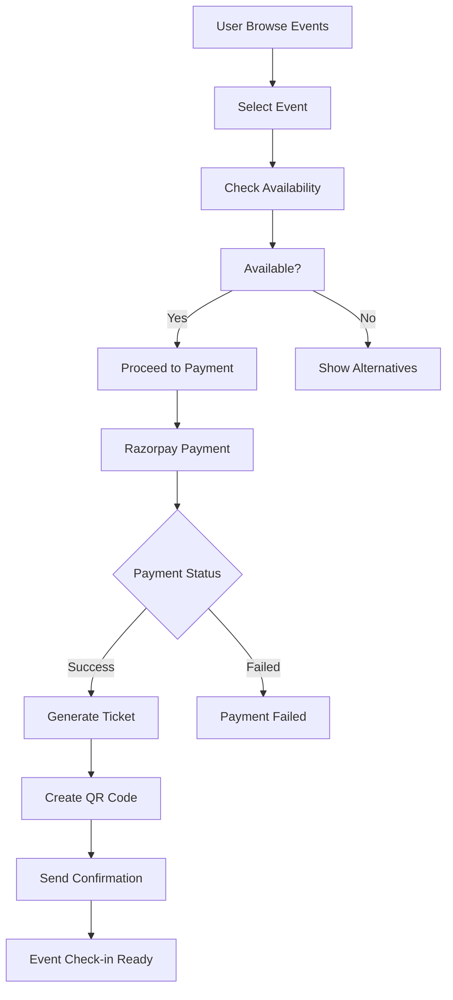

# Fitness Event Booking Platform - Comprehensive Documentation

## 📋 Table of Contents

1. [Project Overview](#project-overview)
2. [Architecture](#architecture)
3. [API Documentation](#api-documentation)
4. [Database Schema](#database-schema)
5. [Authentication & Security](#authentication--security)
6. [Deployment Guide](#deployment-guide)
7. [Configuration](#configuration)
8. [Flow Diagrams](#flow-diagrams)
9. [Testing](#testing)
10. [Troubleshooting](#troubleshooting)
11. [Monitoring](#monitoring)

## 🚀 Project Overview

The Fitness Event Booking Platform is a comprehensive web application built with FastAPI that enables users to discover, book, and participate in fitness events. The platform supports event organizers in creating and managing events while providing a seamless booking experience for participants.

### Key Features

- **🔐 Multi-Authentication System**: JWT tokens, Google OAuth, OTP verification
- **🎫 Event Management**: Create, manage, and discover fitness events
- **💳 Payment Integration**: Razorpay payment gateway for secure transactions
- **👥 Social Features**: User connections, following system, privacy controls
- **📱 QR Code System**: Contactless event check-in system
- **⚡ High Performance**: Redis caching, database connection pooling
- **🛡️ Security First**: Rate limiting, input validation, SQL injection protection
- **📊 Monitoring**: Comprehensive health checks and logging

### Technology Stack

- **Backend**: FastAPI (Python 3.8+)
- **Database**: PostgreSQL (Production) / SQLite (Development)
- **Authentication**: JWT, OAuth 2.0 (Google)
- **Payment Gateway**: Razorpay
- **Caching**: Redis
- **Deployment**: Railway, Docker support
- **Documentation**: OpenAPI/Swagger

## 🏗️ Architecture

```
┌─────────────────┐    ┌─────────────────┐    ┌─────────────────┐
│   Frontend      │    │   FastAPI       │    │   Database      │
│   (React/Web)   │◄──►│   Application   │◄──►│   PostgreSQL    │
└─────────────────┘    └─────────────────┘    └─────────────────┘
                              │
                              ▼
┌─────────────────┐    ┌─────────────────┐    ┌─────────────────┐
│   Redis Cache   │    │   File Storage  │    │   Payment API   │
│   (Sessions)    │    │   (Uploads)     │    │   (Razorpay)    │
└─────────────────┘    └─────────────────┘    └─────────────────┘
```

### Architecture Components

- **API Layer**: RESTful endpoints with automatic OpenAPI documentation
- **Business Logic**: Service layer handling core functionality
- **Data Layer**: Database models and utilities
- **Security Layer**: JWT management, rate limiting, input validation
- **External Integrations**: Payment processing, OAuth providers

## 📚 API Documentation

### Core Endpoints

| Module | Endpoints | Description |
|--------|-----------|-------------|
| **Authentication** | `/auth/*` | User registration, login, OAuth |
| **Events** | `/events/*` | Event CRUD operations, discovery |
| **Tickets** | `/tickets/*` | Booking management, QR codes |
| **Payments** | `/payments/*` | Payment processing, webhooks |
| **Social** | `/social/*` | User connections, privacy |
| **Admin** | `/admin/*` | Management and monitoring |

### API Response Format

```json
{
  "status": "success",
  "data": {
    // Response data
  },
  "message": "Operation completed successfully",
  "timestamp": "2025-01-04T16:08:30+05:30"
}
```

## 🗄️ Database Schema

### Core Entities

- **Users**: Authentication, profiles, social connections
- **Events**: Event details, scheduling, capacity management
- **Tickets**: Bookings, QR codes, validation status
- **Payments**: Transaction records, payment status
- **User Connections**: Following relationships, privacy settings

### Relationships

```
Users ───┬─── Events (Organizer)
         ├─── Tickets (Participant)
         └─── User_Follow (Social)

Events ───┬─── Tickets (One-to-Many)
          └─── Payments (Via Tickets)

Tickets ───┬─── QR_Tokens (Validation)
           └─── Payments (Financial)
```

## 🔐 Authentication & Security

### Authentication Methods

1. **JWT Token Authentication**
   - Access tokens with configurable expiration
   - Refresh token support
   - Role-based access control (RBAC)

2. **Google OAuth 2.0**
   - Social login integration
   - Profile data synchronization

3. **OTP Verification**
   - SMS-based phone verification
   - Multi-purpose OTP (signup, login, password reset)

### Security Features

- **Rate Limiting**: Configurable limits per endpoint
- **Input Validation**: SQL injection protection, XSS prevention
- **Security Headers**: OWASP recommended headers
- **Request Logging**: Comprehensive audit trail
- **File Upload Security**: Filename sanitization, size limits

## 🚢 Deployment Guide

### Quick Start

1. **Prerequisites**
   ```bash
   Python 3.8+
   PostgreSQL (Production)
   Redis (Production)
   ```

2. **Environment Setup**
   ```bash
   cp .env.example .env
   # Configure your environment variables
   ```

3. **Installation**
   ```bash
   pip install -r requirements.txt
   ```

4. **Database Setup**
   ```bash
   # Run migrations
   python migrate_db.py
   ```

5. **Start Application**
   ```bash
   uvicorn main:app --host 0.0.0.0 --port 8000
   ```

### Production Deployment

- **Railway**: Automated deployment with PostgreSQL
- **Docker**: Containerized deployment
- **Environment Variables**: Secure configuration management

## ⚙️ Configuration

### Environment Variables

| Variable | Description | Default |
|----------|-------------|---------|
| `DATABASE_URL` | PostgreSQL connection string | - |
| `JWT_SECRET` | JWT token signing secret | - |
| `RAZORPAY_KEY_ID` | Payment gateway key | - |
| `REDIS_URL` | Redis cache URL | localhost:6379 |
| `GOOGLE_CLIENT_ID` | OAuth client ID | - |

### Configuration Files

- **core/config.py**: Main application configuration
- **alembic.ini**: Database migration settings
- **gunicorn.conf.py**: Production server configuration

## 🔄 Flow Diagrams

### Authentication Flow


### Event Booking Flow


## 🧪 Testing

### Testing Strategy

- **Unit Tests**: Individual component testing
- **Integration Tests**: API endpoint testing
- **Load Tests**: Performance validation
- **Security Tests**: Penetration testing, vulnerability assessment

### Test Files

- `test_*.py`: Integration and load tests
- `pytest` configuration for automated testing

## 🔧 Troubleshooting

### Common Issues

1. **Database Connection Issues**
   - Check DATABASE_URL configuration
   - Verify PostgreSQL credentials
   - Review connection pool settings

2. **Authentication Problems**
   - Validate JWT_SECRET configuration
   - Check token expiration settings
   - Review OAuth configuration

3. **Payment Integration Issues**
   - Verify Razorpay credentials
   - Check webhook endpoints
   - Review payment logs

### Debug Mode

Enable debug logging by setting:
```python
LOG_LEVEL = "DEBUG"
DEBUG = True
```

## 📊 Monitoring

### Health Check Endpoints

- `GET /health`: Comprehensive system health
- `GET /cache-stats`: Cache performance metrics
- `POST /cache-clear`: Cache management (admin)

### Key Metrics

- **Response Times**: API endpoint performance
- **Error Rates**: Failed request tracking
- **Database Performance**: Query execution times
- **Cache Hit Rates**: Redis performance metrics
- **Payment Success Rates**: Transaction completion

### Logging

- **Application Logs**: `app.log`
- **Security Events**: `security.log`
- **Payment Logs**: `payments.log`

---

## 📞 Support

For technical support or questions:
- Check the troubleshooting guide above
- Review application logs for error details
- Verify configuration against this documentation
- Ensure all environment variables are properly set

## 📝 Contributing

1. Follow the established code structure
2. Add tests for new features
3. Update documentation for API changes
4. Follow security best practices
5. Test changes thoroughly before deployment

---

*Last Updated: January 2025*
*Version: 2.0.0*
